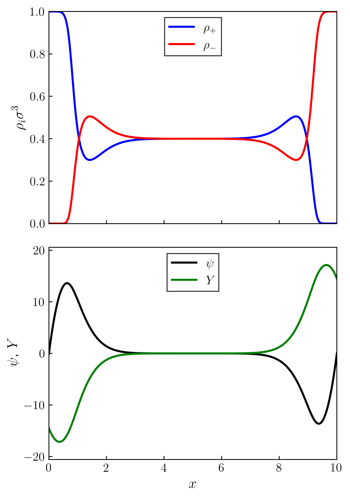

# Ionic Liquid Field Theory

This code computes the equilibrium density and potential profiles of an ionic liquid between two parallel walls/electrodes. The purpose of this code is determine the capacitance and energy storage capabilities of electric double layer capacitors that utilize ionic liquids as the electrolyte.

A version of this code was used to compute all of the results in a paper that I published on this topic.$^1$ The reference is provided below.

[1] Varner, S.; Wang, Z.-G. Dilution Effects in Ionic Liquid Supercapacitors. *Phys. Chem. Chem. Phys.*, **2022**, 24, 27362-27374. https://doi.org/10.1039/D2CP03398D.

If you wish to use this code or a modified version of it, please cite the above reference. Contact me (Sam) at svarner@caltech.edu with any questions.

## Running the Code

The code can be compiled by entering the ```execute/``` folder and running ```make .```. You may need to change the compile flags in the Makefile to suit your system.

The executable will be placed in the ```input/``` folder. From inside the ```input/``` folder, you can run the code using the following command:

```
$ ./ILFT <path-to-input-file>
```

A default input file is provided, which will automatically be used if you pass nothing for the ```<path-to-input-file>``` argument. Note that depending on the initial guess and the choice of parameters, this sytem of equations can be highly unstable and therefore faces convergence issues. If you try parameters that are not working, first try making your initial guess closer to the expected solution. If that does not work, try lowering the mixing parameter.

## Equations

The overall grand free energy of the system includes mixing entropy, electrostatic interactions, Yukawa interactions, nonelectrostatic wall interactions, and the chemical potential Legendre transform. Since the system only exhibits variation in the direction normal to the parallel plates, we can reduce the equation to a 1-dimensional problem by integrating over the in-plane coordinates. The grand free energy per unit area is given by

$$
\begin{aligned}
     \frac{\beta\Omega}{A} &=\int_{-L/2}^{L/2} dz\, [\phi_+\ln{\phi_+}+\phi_-\ln{\phi_-}+(1-\phi_+-\phi_-)\ln{(1-\phi_+-\phi_-)}]\nonumber\\
     &+\int_{-L/2}^{L/2} dz{[\phi+\sigma\delta(z+\frac{L}{2})-\sigma\delta(z-\frac{L}{2})]\psi-\frac{\lambda_0^2}{2}|\frac{\partial\psi}{\partial z}|^2}\nonumber\\
     &+\frac{\alpha}{2\lambda_0^2}\int_{-L/2}^{L/2}dz\int_{-L/2}^{L/2} dz'\, U(z-z')\phi(z)\phi(z')\nonumber\\
     &-\int_{-L/2}^{L/2} dz\,[H_+\phi_++H_-\phi_-]\nonumber\\
     &-\int_{-L/2}^{L/2} dz\,[\mu_+\phi_++\mu_-\phi_-]
\end{aligned}
$$

where $U(z-z')=-\frac{\ell_c}{2}\textrm{e}^{-|z-z'|/\ell_c}$. Extremizing this free energy with respect to all of the fluctuating densities and fields gives the saddle-point or mean-field equations.

$$
\pm, \mp
$$

$$
\begin{aligned}
    &-\lambda_0^2\frac{\partial^2\psi}{\partial z^2}=\phi+\sigma\delta(z+\frac{L}{2})-\sigma\delta(z-\frac{L}{2}),\textrm{ }-\lambda_0^2\frac{\partial\psi}{\partial z}|_{z=\pm L/2}=\sigma\\
    &\frac{\partial^2Y}{\partial z^2}-\frac{Y}{\ell_c^2}=\frac{\alpha}{\lambda_0^2}\phi(z),\textrm{ }\frac{\partial Y}{\partial z}|_{z=\pm L/2}=\mp\frac{Y(\pm L/2)}{\ell_c}\\
    &\ln(\frac{\phi_+}{1-\phi_+-\phi_+})+\psi+Y-H_+-\mu_+=0\\
    &\ln(\frac{\phi_-}{1-\phi_+-\phi_-})-\psi-Y-H_--\mu_-=0\\
\end{aligned}
$$

Since the bulk is homogeneous, we can compute the chemical potentials directly as

$$
\mu=\mu_+=\mu_-=\ln(\frac{\phi^B}{1-2\phi^B})
$$

which allows us to eliminate the chemical potential terms in the equations above, and obtain simple expressions for the densities in terms of the fields (of course the fields still depend on the densities).

$$
\begin{aligned}
    \phi_+&=\frac{\textrm{e}^{-(\psi+Y)}}{(1/\phi^B-2)\textrm{e}^{-H}+2\cosh{(\psi+Y)}} \\
    \phi_-&=\frac{\textrm{e}^{\psi+Y}}{(1/\phi^B-2)\textrm{e}^{-H}+2\cosh{(\psi+Y)}}
\end{aligned}
$$

The profiles are discretized on a grid. Differential equations are solved using the finite difference method with second order accuracy. The fixed point of the full set of equations is found by using an initial guess, and then iterating with simple mixing until the infinity-norm of the error is less than a specified tolderance.

## Example Results

The code can be used to compute the equilibrium density and potential profiles of an ionic liquid between two parallel walls/electrodes. The results can be visualized using the provided Python script in the `analysis/` folder. Below is the result for the provided default input sript, where we can see that there is spontaneous charge separation at the walls, even with 0 surface potential.

